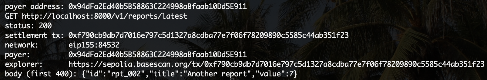
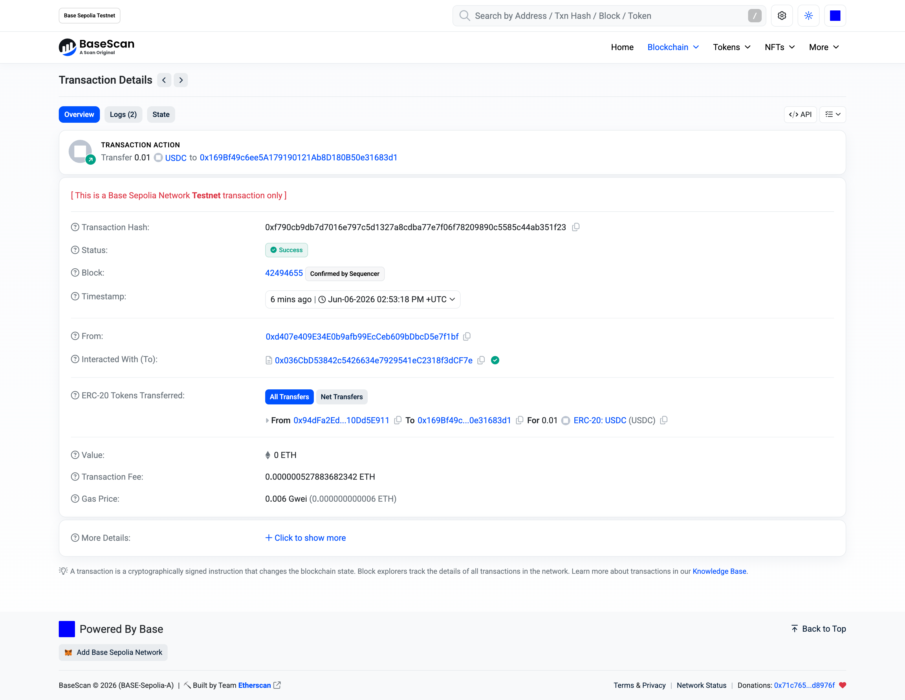

# x402-paid-api-starter

[](https://github.com/Grube82/x402-paid-api-starter/actions/workflows/ci.yml)
[](https://www.python.org/downloads/)
[](LICENSE)

A clean, working **FastAPI starter for charging per API call with [x402](https://x402.org)** — so an AI agent (or a person) can pay a few cents in stablecoin and get your data back instantly. No accounts, no API keys, no Stripe, no credit-card forms.

It's the boring-but-fiddly plumbing, already working: **dual-chain (Base + Solana)**, **testnet → mainnet**, **receive-only** (the server never touches a private key), a **no-JavaScript browser paywall**, **discovery** so buyers can find your endpoints, and a **settlement ledger** so you have your own record of every sale.

> Patterns distilled from a production x402 deployment, rewritten clean-room and generic. MIT licensed — copy it, gut it, ship your own.

---

## What is this, in plain terms?

Normally, selling access to an API means accounts, keys, Stripe, and sign-up forms — and that doesn't work at all when the *buyer is software* (an AI agent can't fill in a credit-card form).

**x402** revives the dormant HTTP `402 Payment Required` status code into a real payment standard: your server replies *"this costs 1 cent, pay me in USDC"*, the client pays in one automatic step, and the data comes back. Think **vending machine for data** — drop a coin, get the thing, no cashier.

This repo is a **ready-to-run vending machine** you can fill with your own data.

---

## Features

- ⚡ **Pay-per-call** on any route you choose, priced in USDC
- 🔗 **Dual-chain** — accept on **Base** (EVM) and **Solana** (SVM) from one config
- 🧪 **Testnet first** — runs on Base Sepolia with the free public facilitator (no real money, no signup), then flip one env var for mainnet
- 🔒 **Receive-only** — the server only ever needs your *public* payee address
- 🌐 **Human-friendly paywall** — browsers get a real static page (no blank-screen JS bundle); agents get the JSON `402`
- 🔎 **Discoverable** — CDP Bazaar extension + a `/.well-known/x402` manifest
- 📒 **Settlement ledger** — every paid call recorded to SQLite (idempotent), so you can answer "how many sales, which routes, how much?" from your own DB
- 🧰 **Example client** — a script that actually pays a route end-to-end (testnet, throwaway wallet)

---

## See it work

The example client paying a route on **Base Sepolia testnet** — the request returns data *and* settles on-chain:



And the same payment confirmed on-chain — a 0.01 USDC transfer to the payee on Base Sepolia:



> The whole loop: `402 challenge → sign → verify → settle on-chain → return JSON`.

---

## Quickstart (testnet, ~5 minutes)

```bash
# 1. Install
pip install -e .

# 2. Configure
cp .env.example .env
# (leave PAYEE_EVM_ADDRESS blank to run everything FREE while you poke around,
#  or set it to a wallet address to require payment on the priced routes)

# 3. Run
uvicorn app.main:app --reload
```

Try the routes:

```bash
curl localhost:8000/v1/ping                 # free   → 200 OK
curl localhost:8000/.well-known/x402        # free   → your price list
curl -i localhost:8000/v1/reports/latest    # paid   → 402 Payment Required
python scripts/peek.py http://localhost:8000/v1/reports/latest   # decode the 402 challenge
```

To watch a **real payment settle** on testnet, see [Paying a route](#paying-a-route-the-client-side).

---

## How it works

```
            ┌─────────────────────── your FastAPI app ───────────────────────┐
request ──▶ │  PaymentGate ──▶ x402 + ledger ──▶ your route handler           │
            │   (keyless?)      (402 / verify / settle / record)              │
            └─────────────────────────────────────────────────────────────────┘
                                   │
                            ┌──────┴───────┐
                            ▼              ▼
                    facilitator       blockchain
                  (verify/settle)    (Base / Solana)
```

1. A client requests a **priced** route with no payment → server replies `402` with the price + your payee address + accepted chains.
2. The client signs a stablecoin payment and retries.
3. The server asks a **facilitator** to verify + settle the payment on-chain.
4. On success, your route handler runs, the response goes back with a settlement receipt header, and one row is written to the ledger.

Free routes (anything not in your price list) skip all of this and pass straight through.

---

## Project layout

```
app/
  config.py      env-driven settings (one place for all configuration)
  pricing.py     ← EDIT THIS: your price list + discovery metadata
  routes.py      ← EDIT THIS: your endpoint handlers (no payment code needed)
  payment.py     the x402 middleware (facilitator, dual-chain, CDP auth, ledger write)
  paywall.py     the static no-JS "Payment Required" page for browsers
  discovery.py   Bazaar extension + /.well-known/x402 manifest
  ledger.py      SQLite settlement log (idempotent)
  main.py        FastAPI entrypoint — wires it all together
scripts/
  peek.py        inspect a route's 402 challenge (no wallet needed)
  pay_example.py pay a route end-to-end (throwaway testnet wallet)
tests/
  test_basic.py  network-free tests
```

---

## Add your own paid endpoint

Two steps — a handler and a price:

```python
# app/routes.py
@router.get("/v1/weather")
def weather(city: str) -> dict:
    return {"city": city, "temp_c": 19}     # your real logic here

# app/pricing.py
ROUTE_PRICING = {
    "GET /v1/weather": "$0.02",             # same "METHOD /path" key
    ...
}
```

That's it. The handler contains **no payment logic** — by the time it runs, the middleware has already verified payment. A route is "paid" purely by being listed in `ROUTE_PRICING`.

---

## Going to mainnet (real USDC)

Testnet uses the free public x402.org facilitator. Mainnet settles real money through Coinbase's **CDP facilitator**, which needs an API key (free tier: 1000 settlements/month — sign up at [portal.cdp.coinbase.com](https://portal.cdp.coinbase.com)).

In `.env`:

```bash
X402_TESTNET=false
PAYEE_EVM_ADDRESS=0xYourBaseWallet
CDP_API_KEY_ID=...
CDP_API_KEY_SECRET=...        # base64-encoded Ed25519 key seed
```

The server signs a short-lived Ed25519 JWT per facilitator call automatically. It still never holds a private key for *receiving* funds — payments go straight to `PAYEE_EVM_ADDRESS`.

### Dual-chain (also accept Solana)

```bash
PAYEE_SOLANA_ADDRESS=YourSolanaBase58Address
```

Every priced route then advertises **two** ways to pay — Base and Solana — and clients choose. (Solana acceptance is mainnet-only.)

> ⚠️ **Pre-fund the Solana payee first.** Send it a tiny amount of USDC before going live so its token account exists; otherwise the first incoming payment can fail.

---

## Discovery

So buyers (and their agents) can find your endpoints:

- **`/.well-known/x402`** — a plain JSON manifest of your price list. Set `PUBLIC_BASE_URL` to include absolute URLs.
- **CDP Bazaar** — per-route metadata (description + example + JSON Schema, from `pricing.py`) is attached to each route so Coinbase's facilitator indexes you in the x402 Bazaar after your first successful mainnet settlement.

That gets you into the Bazaar automatically. To get listed across the **rest** of the ecosystem — 402index.io, x402scan, x402-list, x402gle/Dexter, the awesome-x402 lists — see **[docs/DISCOVERY.md](docs/DISCOVERY.md)**, a directory-by-directory playbook (including the OpenDexter audition flow and the gotchas that fail you silently across every directory at once).

---

## Paying a route (the client side)

`scripts/pay_example.py` completes the full handshake against a running server.

```bash
pip install -e ".[client]"

# Use a THROWAWAY testnet wallet. Fund it with Base Sepolia ETH (gas) + USDC:
#   gas:  https://www.alchemy.com/faucets/base-sepolia
#   USDC: https://faucet.circle.com   (select Base Sepolia)
export PAYER_PRIVATE_KEY=0x...        # throwaway key, never a real one

python scripts/pay_example.py http://localhost:8000/v1/reports/latest
```

It prints the settlement transaction hash and a block-explorer link.

> 🔐 **Never** put a real wallet's private key in a script, an env var on a shared machine, or your shell history. The *server* never needs a private key; only this *client* does, and only a throwaway one.

---

## The settlement ledger

Every settled payment writes one row to a local SQLite file (`LEDGER_DB_PATH`, default `payments.db`): timestamp, route, amount, payer, chain, and the on-chain `tx_hash`. The write is **idempotent** (unique on `tx_hash`), so the same settlement is never double-counted. Read it back with `app.ledger.iter_payment_events()`.

The money itself settles to your wallet on-chain — this is just your own searchable record of sales.

---

## Tests

```bash
pip install -e ".[dev]"
pytest -q
```

The suite is network-free. The full *paid → 402 → settle* path needs a live facilitator + funded wallet, so it's exercised by `scripts/pay_example.py` against a running server rather than in unit tests.

---

## Notes & caveats

- **Pin the SDK.** x402 is young and moves fast; this starter targets the `x402` **2.x** line. If you bump it, re-check the import paths in `payment.py`.
- **`{param}` path templates aren't supported** by x402 route matching — use a query param (`?id=...`) or `[param]`. Query params also keep discovery clean (one template, not one URL per id).
- **Order your price list specific-before-wildcard** — x402 returns the first matching pattern.

---

## About

Built by **[Grube82](https://github.com/Grube82)** — a builder in the agentic-payments space. I orchestrate AI to ship real products, including a live x402 data oracle. This starter is the generic, clean-room distillation of that production plumbing.

## Contributing & security

- Issues and PRs welcome — see [CONTRIBUTING.md](CONTRIBUTING.md).
- Found a vulnerability? See [SECURITY.md](SECURITY.md).

## License

MIT © Grube82 — see [LICENSE](LICENSE).
